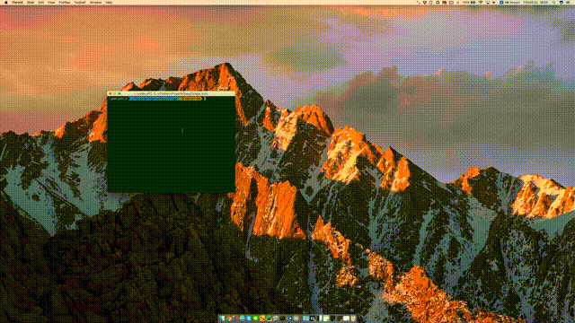

Easy Collage
====

You can make a collage(a.k.a Kuso Kora) easly.

## Demo

## Usage
1. Clone this repository.
2. Launch program.`python EasyCollage.py`
3. Select a reference image.
	- You can zoom and pan using mouse wheel.
4. Select a target image.
5. Click corresponding points.
	- Corresponding points must be the same number.
	- If you make a mistake, press `U` key. You can undo selecting points. 
6. Foucs Result window and press `R` key.
7. Press `S` key. You can save a result image.

## Requirement
- Python 3
- PyQt 5
- OpenCV

## Licence
MIT License

## Author

[drilldripper](https://github.com/DrillDripper)